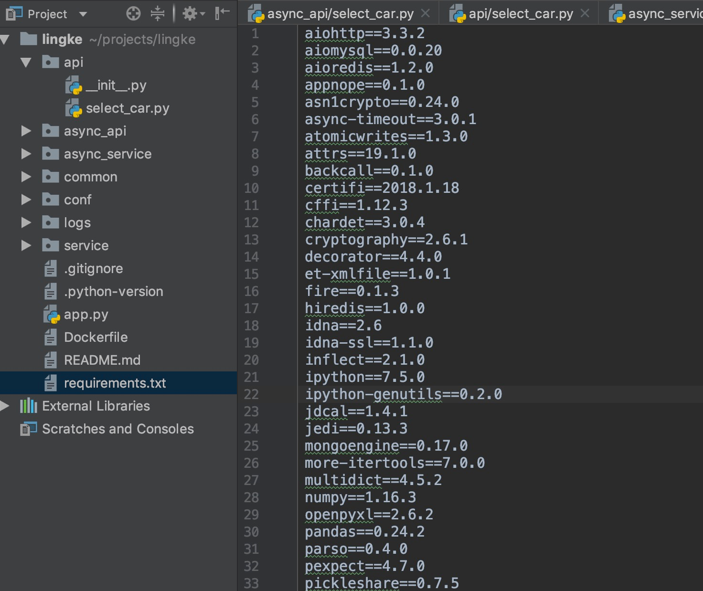

### 通用步骤
1. 论文的阅读，最新算法的研究
    - A、顶级会议论文
        -  机器学习顶级会议: NIPS, ICML, UAI, AISTATS;  
            (期刊: JMLR, ML, Trends in ML, IEEE T-NN)
        -  计算机视觉和图像识别: ICCV, CVPR, ECCV;  
            (期刊: IEEE T-PAMI, IJCV, IEEE T-IP)
        -  人工智能: IJCAI, AAAI;  
            (期刊AI) ACL
    - B、搜索引擎(百度学术，谷歌学术，知乎，百度、谷歌、bing)
    
2. 算法的大概方向的评估和确定
    - A、问题相似度评估
    - B、情景相似度评估
    - C、语言 是否可切换
    - D、确定
3. 训练数据收集，清洗以及数据预处理
    - 数据收集: 公司数据、网络数据、公开数据集、GAN生成数据 
    - 清洗: 数据采样，噪声过滤，数据生成
    - 数据预处理: 特征化和数值化后转化为可训练的数据
4. 算法实现，系统设计，参数调优，模型升级
    -  算法实现: 参考资料论文
    -  系统设计: 软件模块设计架构
    -  参数调优: 更改网络参数
    -  模型升级: 模型算法升级，错误样本再训练
5. 模型效果评估与部署
    - A、准确率
    - B、召回率
    - C、设计lib库本地调用
    - D、封装成服务
    
### 环境依赖
- NumPy NumPy `pip3 install Numpy`
- NLTK （Natural Language Toolkit）`pip install nltk`
- Gensim ：
  - Gensim介绍，下载，安装及在Wing Ide中使用
       -  1)进入http://www.lfd.uci.edu/~gohlke/pythonlibs/
       -  2)下载对应的版本:如python3.6，64位Windows操作系统，应该下载numpy- 1.13.1+mkl-cp36-cp36m-win_amd64.whl，scipy-0.19.1-cp36-cp36m- win_amd64.whl和gensim-2.3.0-cp36-cp36m-win_amd64.whl包。
       -  3)安装下载包的顸序分别安装包，注意顸序丌能改变。安装命令: 
            - 1、pip install gensim
            -  2、Pip install ***.whl文件
- Tensorflow：
    - • Pip install tensorflow
    - • Pip install tf-nightly-gpu/cpu

- jieba : https://github.com/fxsjy/jieba

# requiremnts咋弄的

然后pip install -i xxx（国内源） -r requirements.txt
 
 pip freeze > requirements.txt   这个命令可以帮你生成这个文件